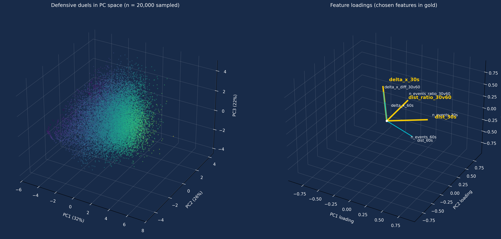
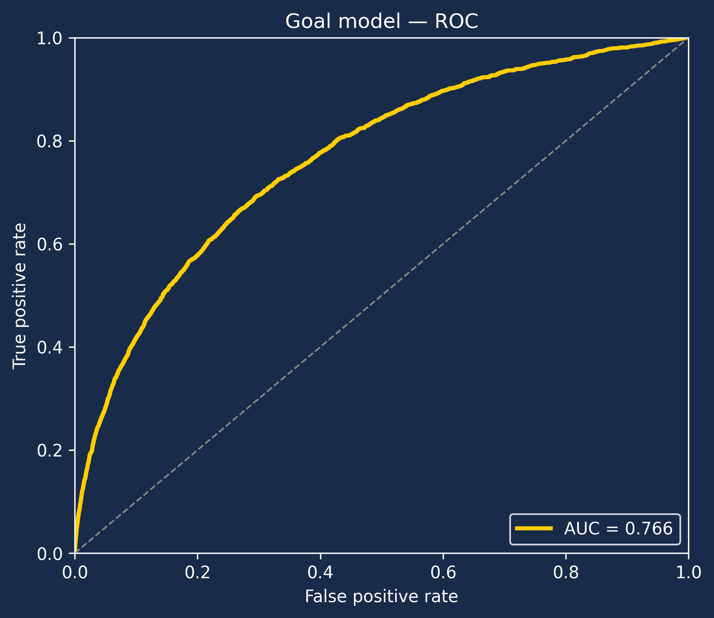
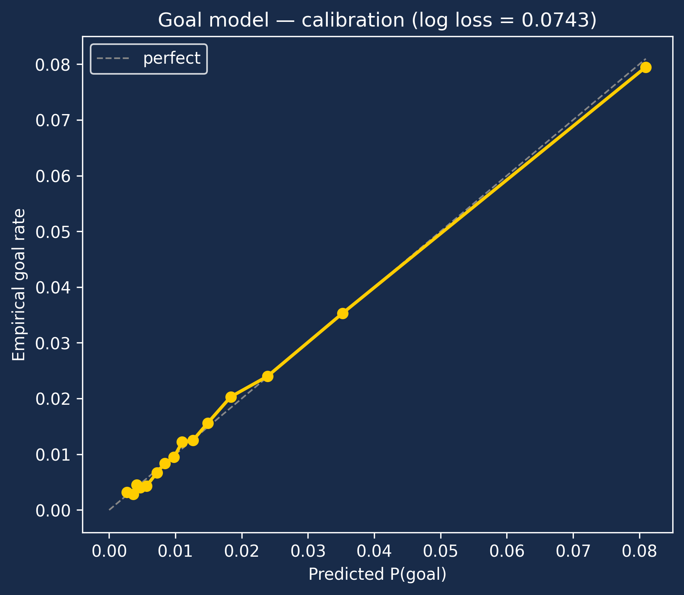
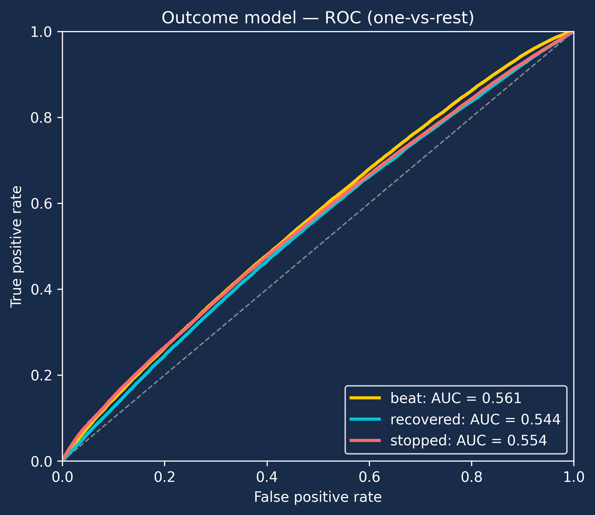
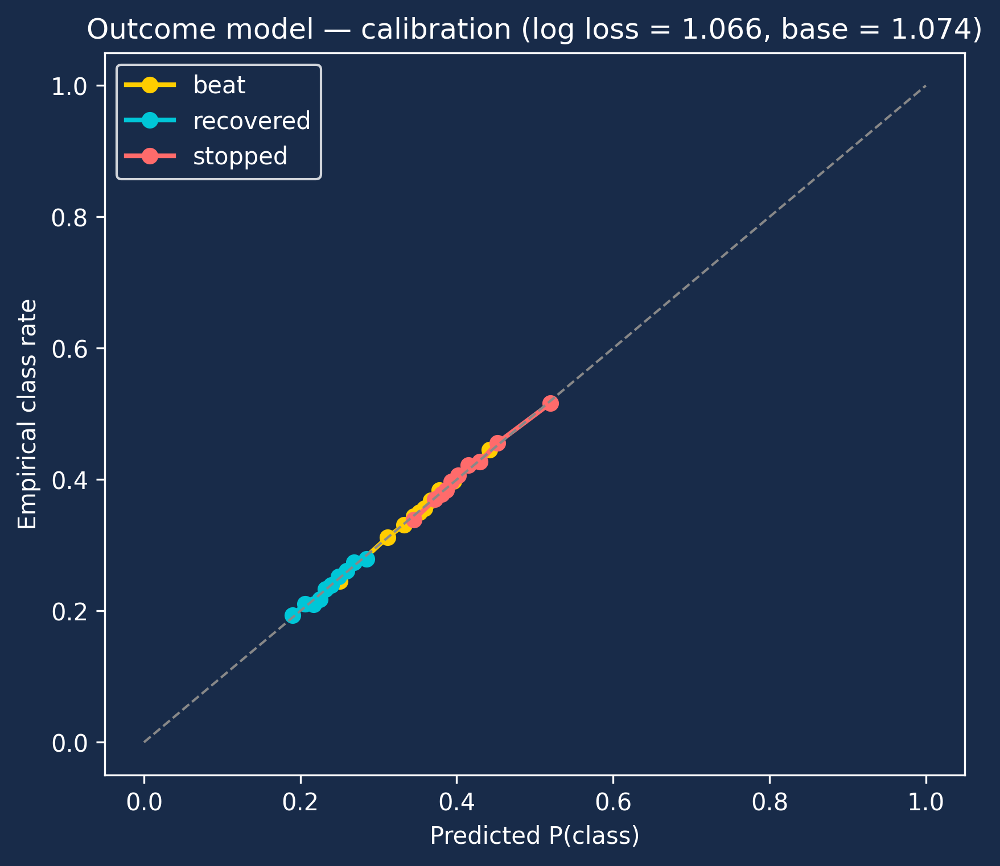
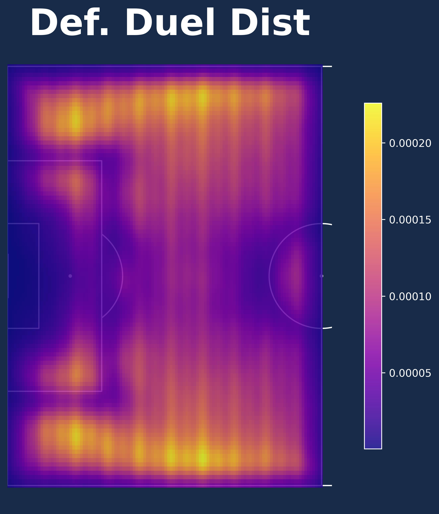
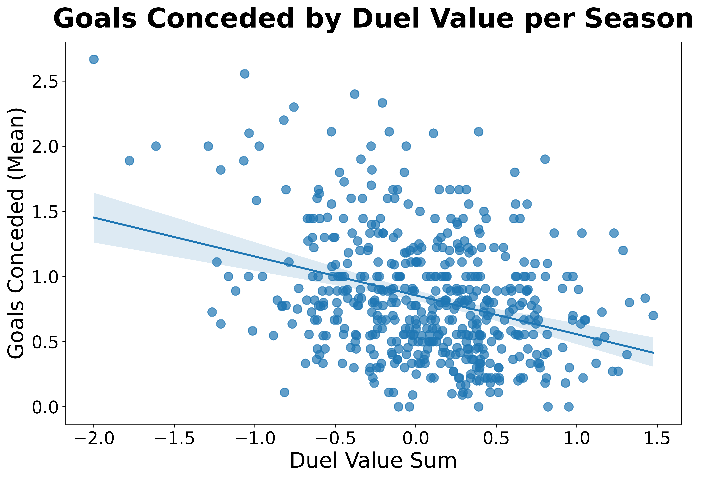

# Defensive Duel Value (DDV)

A location-aware, context-aware metric that scores every defensive duel in
goal-probability units. Positive values mean the defender averted danger
relative to a league-average baseline at the same pitch location; negative
values mean they conceded danger. The metric is built from two LightGBM
models on Wyscout event data, augmented with three speed-of-play context
features distilled from a nine-feature PCA.

This repository contains the preprocessing pipeline, the training script for
the SOP-aware DDV models, exploration notebooks for the modelling and
validation work, and a static web explainer in `index.html`.

---

## 1. Background

Most public-facing defender metrics are descriptive — tackles won,
interceptions, aerial-duel rate. They count *what happened* and don't ask
whether the action mattered. A tackle in the centre circle and a last-ditch
challenge in the six-yard box are scored the same. They also don't account
for *outcome quality*: a duel that recovers possession is worth far more
than one that merely halts attacker progress, and both are worth more than
losing the duel outright.

The goal of this project is to assign each defensive duel a single scalar
that answers a precise question:

> *How much goal probability did this defender remove from the next 20
> seconds of play, relative to what we'd expect at this pitch location given
> what was happening before the duel?*

The metric is built out of three components:

1. A **categorical outcome** for each duel — `recovered`, `stopped`, or
   `beat` — collapsing two overlapping Wyscout booleans into one mutually
   exclusive label.
2. A **conditional goal model** that estimates `P(goal in 20s | x, y, sop, c)`
   for each possible outcome `c`.
3. An **outcome model** that estimates `P(c | x, y, sop)` so the conditional
   goal model can be marginalised back to the unconditional baseline at the
   same location.

The duel value is the difference between the location's expected danger and
the danger realised by the observed outcome — see Section 4.

---

## 2. Data

Data from 800k+ defensive duels across 7k+ Wyscout matches were analyzed. 
Defensive duels are filtered to the defending half (`start_x < 60` in
StatsBomb 120×80 coordinates) before training so the model is fit on the
distribution where the metric is meaningful — duels in the attacking third
have negligible goal-conceding implications.

The 20-second look-ahead label `outcome ∈ {-1, 0, 1}` (goal conceded /
neutral / goal scored) is computed by `preprocess.py` from the raw event
stream; the goal-conceding model treats `outcome == -1` as the positive
class.

---

## 3. Methods

### 3.1 Outcome encoding

The Wyscout schema exposes two overlapping booleans for each ground duel —
`groundDuel_recoveredPossession` and `groundDuel_stoppedProgress` — and a
recovery is also flagged as having stopped progress. We collapse these into
a single ordinal categorical with priority `recovered > stopped > beat`:

Best-to-worst: `recovered` (defender wins the ball) → `stopped` (defender
halts attacker progress without recovery) → `beat` (attacker retains
possession and progresses).

### 3.2 Speed-of-play context — selecting speed of play features

A duel's danger profile depends on more than just where it happens. A duel
at `(x=30, y=40)` after the opponent has been pushing forward at speed for
the last 30 seconds is in a very different game state from the same
coordinates at the start of a slow build-up. We capture this with **speed
of play (SOP)** features — per-event statistics over a 30-second lookback,
oriented from the team-of-interest's perspective so that prior-event
coordinates from the *opposing* team are flipped to `(L − x, W − y)`.

The full nine-feature SOP set is:

| Feature                  | Meaning                                                         |
| ------------------------ | --------------------------------------------------------------- |
| `n_events_30s`           | Event rate over the last 30 s.                                  |
| `delta_x_30s`            | Net x-displacement in the last 30 s, oriented to the **defending team's POV**. Positive ⇒ the ball moved *away from* the defending goal; negative ⇒ the ball moved *toward* the defending goal (opponent pushing in). |
| `dist_30s`               | Total path length traced by the ball over the last 30 s.        |
| `n_events_60s`           | Same as above over a 60 s window.                               |
| `delta_x_60s`            | Same as `delta_x_30s` over a 60 s window.                       |
| `dist_60s`               | Same as `dist_30s` over a 60 s window.                          |
| `n_events_ratio_30v60`   | 30 s event rate divided by 60 s rate (acceleration in tempo).   |
| `dist_ratio_30v60`       | 30 s distance divided by 60 s distance (acceleration in space). |
| `delta_x_diff_30v60`     | 30 s forward progression minus 60 s baseline (same orientation as `delta_x_30s`). |

This is too many to feed a tree model on a binary target with a 1.6%
positive rate without overfitting noise — and most of the nine are highly
correlated (a 30 s feature and a 60 s feature on the same axis carry
overlapping information). To compress the set, we standard-scaled the
nine-feature matrix and ran PCA on every defensive duel in the dataset.
The first three components explain **80% of the variance**
(31.9% / 26.1% / 22.2%). Plotting the duels in PC space alongside the
loading vectors for the nine features shows three clearly distinct
directions:

  

We picked one feature with a high loading on each PC so the chosen 3-feature
set spans roughly the same variance the PCA recovered:

| Chosen feature       | PC it represents | What a high value means                                            |
| -------------------- | ---------------- | ------------------------------------------------------------------ |
| `dist_30s`           | PC1 — volume     | The ball travelled a long total distance in the last 30 s — busy phase. |
| `dist_ratio_30v60`   | PC2 — tempo      | The last 30 s was busier than the prior 60 s — accelerating phase. |
| `delta_x_30s`        | PC3 — direction  | Ball moved *away from* the defending goal in the last 30 s (defending team's POV); negative values mean the opposite — opponent pushing toward the defending goal. |

This collapses the SOP context to three uncorrelated, easily-interpretable
features while keeping the variance the PCA said mattered. Fully capturing the speed of play context behind the defensive duel

### 3.3 Two LightGBM models

Both models are trained on the same 816 K defensive duels in the defending
half, with an 80/20 stratified train/test split (`random_state=42`).

**Outcome model.** Multiclass classifier over `{recovered, stopped, beat}`
with features `(start_x, start_y, delta_x_30s, dist_30s, dist_ratio_30v60)`.

**Conditional goal model.** Binary classifier on `(x, y, sop, c)` where `c`
is the LightGBM-categorical outcome code. The positive class is "goal
conceded within the 20-second look-ahead" and is rare (~1.6%). `min_child_samples=500`
keeps the leaves large; we deliberately do **not** apply `scale_pos_weight`
because the value formula uses *differences* of conditional probabilities,
and rebalancing would inflate raw scores while still ranking correctly.
Leaving the model on its native prior keeps calibration tight at low
predicted probabilities, which is where almost all duels sit.

### 3.4 Why one conditional model, not two unconditional ones

The expected-danger term `P(goal | x, y, sop)` could in principle come from
a separately trained `(x, y, sop) → goal` model. We don't do that. The
algebraic identity in Section 4 only holds when both pieces are derived
from the *same* model, by marginalising the conditional model:

$$P(\text{goal} \mid x, y, \mathrm{sop}) = \sum_c P(c \mid x, y, \mathrm{sop}) \cdot P(\text{goal} \mid c, x, y, \mathrm{sop})$$

Mixing a separate unconditional goal model would introduce residuals that
reflect *differences in model bias* rather than differences in defender
performance. Marginalising the same model eliminates that confound.

---

## 4. The value formula

Per duel:

$$v(\text{duel}) = \underbrace{\sum_c P(c \mid x, y, \mathrm{sop}) \cdot P(\text{goal} \mid c, x, y, \mathrm{sop})}_{\text{expected danger}}
\;-\; \underbrace{P(\text{goal} \mid c^\star, x, y, \mathrm{sop})}_{\text{realized danger}}$$

where `c*` is the observed outcome of *this* duel. Sign convention:
positive ⇒ the defender produced a *less dangerous* outcome than the
location-and-context prior would predict. Negative ⇒ they conceded
unexpectedly dangerous post-state.

---

## 5. Model training & validation

### 5.1 Conditional goal model

The conditional goal model is the workhorse — it produces the
`P(goal | c, x, y, sop)` lookup that drives both terms of the value
formula. With ~10.5 K positives in 653 K training rows, ranking is the
quantity that has to be right.

| Metric              | Value     |
| ------------------- | --------- |
| ROC AUC             | **0.766** |
| PR AUC              | 0.073     |
| Log loss            | 0.0743    |
| Base rate (positive) | 1.62%    |

ROC AUC of 0.766 on a 1.6% positive rate from `(x, y, c, sop)` features
alone is a strong signal — the model is reliably ordering high-danger
states above low-danger states across ~163 K test duels. PR AUC of 0.073 is
a ~4.5× lift over the 0.016 base prevalence, which is the right-shaped
result for a sparse, location-conditioned label.

  
  

The ROC curve (left) climbs steeply in the bottom-left corner, hitting a
TPR of ~0.6 at a 20% FPR. That left-corner steepness is what we care
about for ranking — the high-confidence end of the score distribution
catches most of the goal-conceding cases. Calibration (right) is excellent
across the realised range of predicted probabilities (0–8%): the binned
empirical goal rate tracks the diagonal to within rounding. Because we
did **not** apply `scale_pos_weight`, predicted probabilities can be read
directly as expected goal-concession rates rather than as
monotonic-but-distorted scores. This is the property that makes
`expected_danger − realized_danger` meaningful as a goal-probability.

### 5.2 Outcome model

The outcome model is a low-AUC, well-calibrated classifier — and that's
exactly what we want. Its job is **not** to predict the outcome of any
individual duel from `(x, y, sop)` (which is impossible — the outcome is
substantially driven by player skill, body shape, and pressure that aren't
in the feature set). Its job is to give a calibrated *prior* over the three
outcome classes at the duel's location and game state, so the marginalisation
in Section 4 produces an unbiased baseline.

| Metric                     | Value             |
| -------------------------- | ----------------- |
| Multiclass log loss        | **1.066**         |
| Class-prior baseline log loss | 1.074          |
| One-vs-rest AUC — beat     | 0.561             |
| One-vs-rest AUC — recovered | 0.544            |
| One-vs-rest AUC — stopped  | 0.554             |

  
  

OVR AUCs (left) are barely above chance (0.54–0.56). That's the honest
answer — location and SOP barely move the needle on *which* outcome a
duel will produce, because the outcome is dominated by features the model
can't see. What matters here is the *calibration* (right): the three
curves sit tightly on the diagonal across the entire realised range of
predictions (~0.2 to ~0.5). This is the property that makes the model
usable as a probabilistic prior — the predicted probabilities match
empirical class rates, so when we marginalise them against the
conditional goal model in Section 4 we get an unbiased expected danger.

---

## 6. What the models look like on the pitch

Heat maps are produced by evaluating the trained models on a 120 × 100
grid of `(x, y)` points covering the defensive half, with the SOP features
held at their dataset medians. The pitch is rendered with `mplsoccer` on
the UCSD navy poster background. All maps are oriented so attackers move
left-to-right; the pitch shown is the defending half.

### 6.1 Where defensive duels happen

  

Duels concentrate along the wings and at the box edges, with vertical
striping driven by the discrete pixel grid of player positions in the
event data. The box itself sees fewer duels — by the time an attacker
gets there, defenders have usually already engaged or shots have already
been taken.

### 6.2 P(outcome | x, y) — the spatial outcome prior

  

- **`P(beat)`** is highest in the central channel just outside the
  18-yard box and along the edges of the defending end-line. These are
  the regions where attackers have angles, defenders are stretched, and
  retaining possession is easier for the attacking side. Peak ~0.45.
- **`P(recovered)`** peaks in a band centred on the top of the box and
  out into the central third — the zone where defenders have time, support,
  and a strong angle on the ball. Peak ~0.30.
- **`P(stopped)`** dominates the deep wide channels and the back corners
  of the defending half. Peak ~0.60. Interpretation: when an attacker
  pushes the ball into the corner, defenders frequently halt progress
  without quite recovering — the outcome lands in the middle bucket.

The three panels sum to 1 at every pixel, so the relative dominance shifts
across the pitch but the total is conserved.

### 6.3 P(goal | x, y, c) — danger conditional on outcome

  

The asymmetry here is the most striking single result of the model:

- **`P(goal | beat)`** has a sharp hot spot inside the 18-yard box,
  peaking at ~0.30 in the central channel just inside the penalty area.
  Being beaten near goal is catastrophic — the model assigns up to a 30%
  probability of conceding within 20 seconds.
- **`P(goal | recovered)`** is essentially zero everywhere. Recovering
  possession resets the action sequence; the model correctly learns that
  the danger in the next 20 seconds is negligible regardless of where
  the recovery happened. This is what makes "recovered" the best outcome
  by a wide margin.
- **`P(goal | stopped)`** is intermediate, with a hot spot of ~0.10
  in the same penalty-area region as `P(goal | beat)` but at one-third
  the magnitude. Stopping progress without recovering still leaves the
  attacker with the ball, but the model has learned that a halted
  attacker is materially less dangerous than an advancing one.

The differential between `beat` and `stopped` near the box is what gives
the metric most of its discriminating power: a defender who turns a
"would-have-been-beat" event into a "stopped" event removes ~0.20
goal-probability at a peak location, which is an enormous per-action
contribution by football-analytics standards.

### 6.4 Per-outcome duel value

  

This collapses the previous panel into the actual value the metric
assigns:

- **`duel_value | beat`** is deep blue inside the 18-yard box (~−0.20):
  being beaten there is catastrophic for the defender's value.
- **`duel_value | recovered`** is bright red in the same region (+~0.10):
  recovering near the box is exceptionally valuable.
- **`duel_value | stopped`** is near zero everywhere — by definition,
  "stopped" is close to the baseline outcome at most locations. The
  signal in this panel is small but consistent and slightly positive in
  the central box region.

---

## 7. How the SOP features bend the surface

For each chosen SOP feature we held the other two SOP features at the
dataset median and the pitch coordinates at every `(x, y)`, then varied
the feature of interest from its 10th to 90th percentile. The maps below
show **`Δ = P(high SOP) − P(low SOP)`** — the spatial pattern of how each
SOP feature moves the model's predictions. Rows index the SOP feature
under variation; columns index the outcome class.

### 7.1 SOP impact on outcome probability

  

- `delta_x_30s` (top row): the panel shows `P(high) − P(low)` — i.e.
  going from "opponent pushing toward the defending goal" (low) to
  "ball moved away from the defending goal" (high, e.g. the team had
  just been progressing forward). In that direction, `P(beat)` rises
  in the wide channel near the defending byline (+0.04) and
  `P(recovered)` falls in the central penalty area — a counter-attack
  signature: when the team was on the attack and lost the ball,
  defenders are out of shape and central recoveries are harder.
  Modest magnitudes (±0.04) but spatially coherent.
- `dist_30s` (middle row): high ball-travel volume mostly nudges
  `P(recovered)` up in the central penalty area (busy phases produce
  scrambles, scrambles produce recoveries). Smallest of the three SOP
  effects on outcome (±0.02).
- `dist_ratio_30v60` (bottom row): tempo acceleration pulls `P(stopped)`
  *down* in the wide-left defensive corner (∼−0.07) and shifts mass
  toward `P(beat)` — accelerating attacks along the wing produce more
  beats and fewer "merely halted" outcomes.

### 7.2 SOP impact on goal probability

  

- `delta_x_30s` × `beat` (top-left): going from "opponent pushing
  toward the defending goal" (low) to "ball moved away from the
  defending goal" (high) lifts `P(goal | beat)` by ∼+0.04 at the
  centre of the box. There is a small negative pocket in the wide
  byline corner — under sustained opponent pressure (low
  `delta_x_30s`), wide beats there are slightly *more* dangerous than
  in the counter-attack regime.
- `dist_30s` × `beat` (middle-left): the largest single SOP effect in
  the model. Busy prior 30 s pushes `P(goal | beat)` up by **+0.13** in
  the 6-yard box. A defender beaten in the box during a sustained
  attacking phase is in a fundamentally more dangerous state than the
  same beat during a slow build-up.
- `dist_ratio_30v60` × `beat` (bottom-left): a small-amplitude
  (+0.015) but spatially localised effect along the top of the 18-yard
  box during accelerating phases.
- **Recovered column is essentially flat across all SOP features** —
  recovering possession resets the attacking sequence, so prior tempo
  and direction stop mattering.
- **Stopped column tracks beat with ∼⅓ the magnitude** — same spatial
  hot spot in the central penalty area, smaller amplitude. Confirms
  that the `beat → stopped` improvement is real and SOP-modulated.

**Summary.** SOP features produce small-to-moderate shifts in *outcome*
probabilities (±0.07 at strongest) and one large shift in *conditional
goal probability* — a +0.13 amplification of `P(goal | beat)` in the
6-yard box during high-volume phases. Most of the SOP effect on the
final duel value flows through that single channel.

---

## 8. Performance validation

The model is trained per-duel; the question is whether its aggregated
output is meaningful at the team-and-season level. Goals conceded per
match is the natural target — if the metric is a real defensive signal,
seasons where a team accumulates positive duel value should see fewer
goals conceded.

### 8.1 Season goals conceded vs. duel value

  

Each point is one (season, team) pair (n = 516 after the 8-game minimum
filter). The fitted line has a clear negative slope: teams accumulating
positive duel value over a season concede materially fewer goals per
match. The relationship has visible scatter — duel value is one of many
inputs into goals conceded, alongside set-piece defending, shot-stopping,
pressing structure, and opponent finishing — but the slope and tightness
are inconsistent with noise.

### 8.2 Univariate R² across duel features

For each candidate predictor we fit a univariate OLS with season-mean
goals conceded as the target and report R²:

| Predictor                                | R²    |
| ---------------------------------------- | ----- |
| `duel_value_sum`                         | **0.11** |
| `duel_value_mean`                        | 0.10  |
| `groundDuel_recoveredPossession_rate`    | 0.08  |
| `groundDuel_stoppedProgress_count`       | 0.05  |
| `groundDuel_recoveredPossession_count`   | 0.01  |
| `groundDuel_stoppedProgress_rate`        | 0.00  |

Two readings:

1. **`duel_value` beats every counting and rate stat.** Total season duel
   value (R² = 0.11) and per-duel mean duel value (R² = 0.10) are the
   strongest univariate predictors of season goals conceded. The DDV
   metric extracts more season-level defensive signal than recovery rate,
   stopped-progress count, or any of their volume-only equivalents.
2. **Stopped-rate alone is uninformative.** Its R² of 0.00 confirms that
   counting "halted progress" without modelling the *location* and
   *outcome* of those halts is essentially useless for predicting goals
   conceded. The DDV metric implicitly does that work — it weights each
   `stopped` outcome by the goal probability it averted at the actual
   pitch location, given the actual game state.

The exact same ranking holds on a season-win-rate target (table not
shown) and on the per-match level (`xg_against` is the strongest
predictor as expected, with `duel_value_sum` second).

---

## 9. Conclusion

DDV is a per-duel metric that sums to a season-level defensive quality
signal. It outperforms every counting and rate alternative on goals
conceded, while remaining additive — every duel a player or team
contributes to is on the same scale, and the leaderboard is just a
groupby-and-sum.

Two natural use cases:

**Recruiting.** A defender's career profile in DDV captures the part of
defensive quality that volume stats miss: how dangerous were the
locations they engaged in, what outcomes did they produce relative to a
league baseline at those locations, and how did they perform when the
game state was already against them (high SOP, opponent attacking
forward at speed). Total DDV rewards opportunity and skill in
combination; per-duel DDV rewards efficiency. Filtering the per-duel
leaderboard by minimum opportunity (`n` duels or minutes played) gives
a noise-controlled efficiency rank that highlights players who are
producing better-than-baseline outcomes at the moments where it matters.
A defender with modest tackle counts but consistently positive per-duel
DDV is producing real defensive value — the kind that the existing
descriptive metrics will systematically undercount.

**Game and tactical analysis.** Aggregating DDV by zone, by phase of
play (using the SOP signals), or by player on a single team surfaces
where defensive value is being generated and where it's leaking. A
team that accumulates positive value in central zones but negative
value in wide channels is communicating a clear tactical pattern.
Per-match DDV plotted against `xg_against` flags games where the team
was structurally vulnerable but bailed out by the keeper, or vice
versa. Analysts can use the per-outcome decomposition (`recovered` vs
`stopped` vs `beat` value at each location) to ask whether a defender's
lapse cost goal probability or merely produced a slower attacking
phase.

In both cases, the underlying premise is the same: every defensive duel
should be priced in the units we actually care about — goal probability —
and the price should account for *where* the duel happened and *what was
going on around it*. DDV does that, and the season-level validation
confirms the price tag tracks reality.

